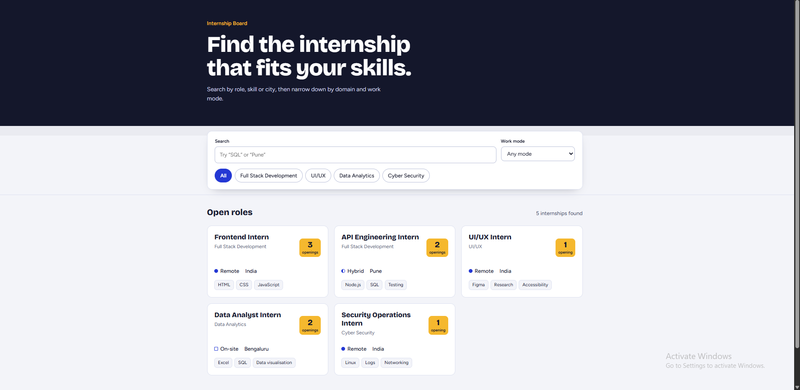

# Responsive Internship Board

An accessible internship listing interface that works on mobile, tablet and desktop. Built with plain HTML, CSS and JavaScript, with no framework.

**Live preview:** https://github.com/Rishavgupta333/Responsive-internship-board
## Screenshots

| Mobile | Tablet | Desktop |
|---|---|---|
|  |  ## Screenshots



## Features

- Search by role, skill, domain or city
- Domain filter chips and a work mode filter (Remote, Hybrid, On-site)
- Results count announced to screen readers with `aria-live`
- Empty state with a "Clear filters" button
- Error state with a "Try again" button when the data fails to load
- Keyboard navigation, skip link, visible focus styles and labelled form fields
- Responsive grid that adapts from one column to multiple columns
- Respects `prefers-reduced-motion`

## Tech

- Semantic HTML5
- CSS with custom properties, Grid and media queries
- Vanilla JavaScript (`fetch`, DOM rendering, array filtering)
- Fictional internship data in `data/internships.json`

## Project structure

```
internship-board/
├── index.html
├── styles.css
├── app.js
├── data/
│   └── internships.json
└── screenshots/
```

## Run locally

`fetch()` does not work on `file://`, so use a local server:

1. Open the folder in VS Code and run **Live Server** on `index.html`, or
2. Run `npx serve` or `python -m http.server` in the project folder.

## Accessibility notes

- Every input has a visible `<label>`
- Domain chips are buttons with `aria-pressed`
- Work mode is shown with a shape and text, not colour alone
- Text colours meet WCAG AA contrast on their backgrounds

## What I learned

Replace this with 2 to 3 lines about what you learned, for example how you handled filtering, empty and error states, and responsive layout.
